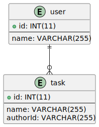

# NestJS ToDo App RESTful API
A sample RESTful API built with NestJS. Jest is used for a testing framework.

## ER diagram


## Tools

|Tools|Versions|
|-----|--------|
|Node.js|18.13|
|TypeScript|4.9.4|
|NestJS|9.0.0|
|TypeORM|0.3.1|
|Jest|29.3.1|
|Docker|20.10.21|
|Docker Compose|2.13.0|
|MySQL|8.0.28|

## Installation
```bash
git clone https://github.com/Fanta335/nest-sample-todo-app
cd nest-sample-todo-app
```
### Attension
Make sure to create `.env.dev` & `.env.test` files. e.g.
```
DB_PASSWORD=password
DB_DBNAME=develop
DB_USERNAME=develop
DB_PORT=3306
DB_HOST=localhost

```
Then you can start development server with following command:
```bash
docker compose --env-file .env.dev -f docker-compose.dev.yml up
```
If you want to start E2E test server:
```bash
docker compose --env-file .env.test -f docker-compose.test.yml up
```

